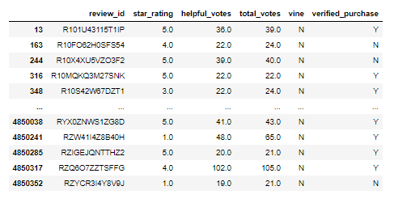
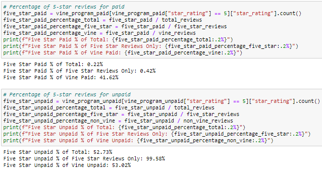

# Amazon Vine Analysis
Finished Deliverables:  
[Amazon Reviews ETL](/Amazon_Reviews_ETL.ipynb)  
[Vine Review Analysis](/Vine_Review_Analysis.ipynb)  
## Overview
Perform ETL process, connect to AWS RDS instance, load the data into pgAdmin, and use Pandas to uncover possible favorable review bias among Vine subscribers vs. non-subscribers.
## Results
The raw data row count is 4,850,360, but there are 797 review_ids with no other information.  When we filter the data to 20 votes or more and 50% or more helpful, these blanks are go away, and we are left with 61,948 rows.  
  
In the filtered dataset, there are 334 Vine reviews and 61,614 non-Vine reviews  
* 139 Vine reviews received 5 stars  
* 32,665 non-Vine reviews received 5 stars  
  
  

## Summary
The results from the image above suggest that xxxxx.  For further analysis, xxxx.
